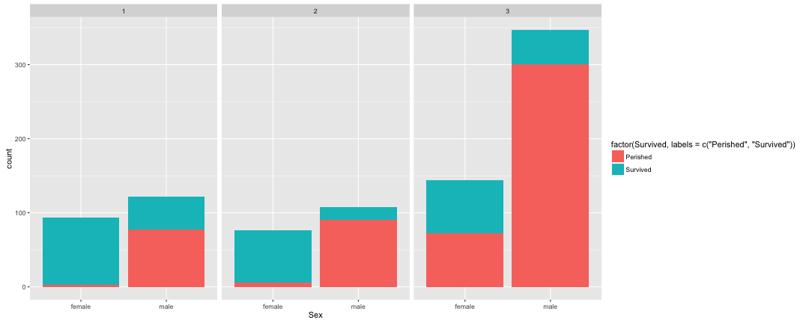

## Titanic Survivor Analysis
<br/>
<br/>

Nikhil W

<span style="color:gray;">Developing Data Products - Project</span>


---
### Project Overview
The objective for this project is to develop a model for prediciting passgenger survival on the Titanic accident.


Lets look at the train dataset available to us.

```r
library(ggplot2)
dtrain <- read.csv("train.csv")
```

```r
str(dtrain)
```

```
## 'data.frame':	891 obs. of  12 variables:
##  $ PassengerId: int  1 2 3 4 5 6 7 8 9 10 ...
##  $ Survived   : int  0 1 1 1 0 0 0 0 1 1 ...
##  $ Pclass     : int  3 1 3 1 3 3 1 3 3 2 ...
##  $ Name       : Factor w/ 891 levels "Abbing, Mr. Anthony",..: 109 191 358 277 16 559 520 629 417 581 ...
##  $ Sex        : Factor w/ 2 levels "female","male": 2 1 1 1 2 2 2 2 1 1 ...
##  $ Age        : num  22 38 26 35 35 NA 54 2 27 14 ...
##  $ SibSp      : int  1 1 0 1 0 0 0 3 0 1 ...
##  $ Parch      : int  0 0 0 0 0 0 0 1 2 0 ...
##  $ Ticket     : Factor w/ 681 levels "110152","110413",..: 524 597 670 50 473 276 86 396 345 133 ...
##  $ Fare       : num  7.25 71.28 7.92 53.1 8.05 ...
##  $ Cabin      : Factor w/ 148 levels "","A10","A14",..: 1 83 1 57 1 1 131 1 1 1 ...
##  $ Embarked   : Factor w/ 4 levels "","C","Q","S": 4 2 4 4 4 3 4 4 4 2 ...
```


---
### Data Visualization
In order to better understand the relationship between different variables in the dataset, let's plot relationship between Passenger Class, Gender and Survived (0 or 1).

```r
g <- ggplot(data = dtrain, aes(Sex, fill=factor(Survived, labels =c("Perished","Survived")))) + geom_bar() 
g + facet_grid(.~ Pclass)
```



<span style="font-size:26px;">From above we can infer that male passengers from 3rd class cabin were among the most perished. Female passengers across all Cabin Classes survived the most.</span>

---

### Model Generation

<div align="left">
Here we'll utilize 2 classification Models :
<br/>
1. RPart
</div>

```r
rpart(formula = as.factor(Survived) ~ Sex + Parch + SibSp + Pclass + Fare + 
    Embarked, data = dtrain, control = rpart.control(minsplit = 10, cp = 0.01), 
    na.action = na.exclude)
```


```r
Confusion Matrix and Statistics

          Reference
Prediction   0   1
         0 521 130
         1  28 212
                                         
         Accuracy : 0.8227 
```
          

<div align="left">
2. RandomForest
</div>

```r
randomForest(formula = as.factor(Survived) ~ Sex + Parch + SibSp + Pclass + 
    Fare + Embarked, data = dtrain, mtry = 5, nodesize = 10, ntree = 500, na.action = na.exclude)
```


```r
Confusion Matrix and Statistics

          Reference
Prediction   0   1
         0 526  77
         1  23 265
                                          
         Accuracy : 0.8878 
```


---

## Summary

Looking at the results of previous models we can conclude that the RandomForest Model yields higher accuracy of <span style="color:orange;">88.78%</span>.
<br/>
<br/>

Couple Points to remember :
- The model can be further improved by varying the tuning parameters <span style="color:cyan;">mtry, nodesize & ntree</span>.
- The current model is validating against Train dataset, which can cause overfitting.
- To improve the model the trainset can be split into Train and Validate sets.


